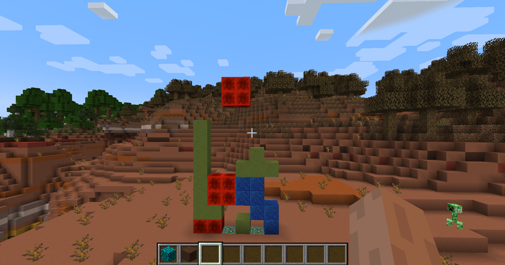

# GameMC

This Mod allow to play Tetris in minecraft.

# Installation

1) Install MCreator 2024: https://mcreator.net/download/2024-1
2) Execute tetris.mcreator

# How to play ?

In creative mode, place a tetris bloc somewhere.

Use left and right touch to deplace the tetris blocks, and "j" to rotate.
